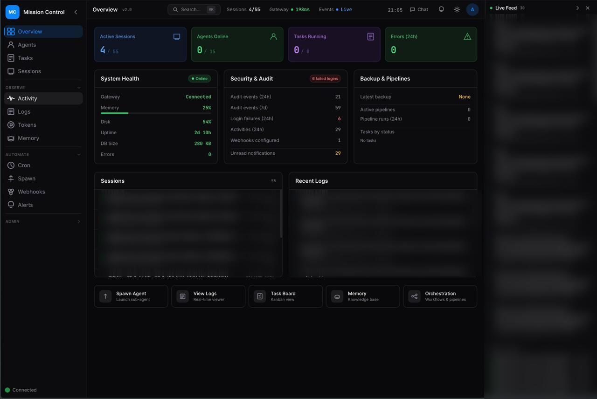
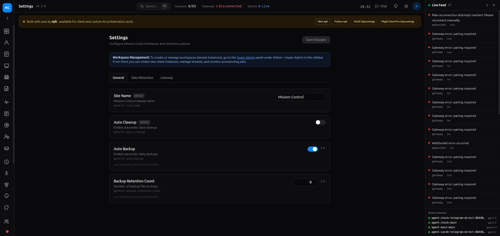

# Deployment Guide

This guide is written in a Docker Hub friendly format (similar to LinuxServer-style docs), including:
- `docker run` quickstart
- fully commented `docker-compose.yml` examples
- environment variables and volume mappings
- common operations and troubleshooting

---

## What this image does

`openalpineai/mission-control` runs the Mission Control web app for OpenClaw operations:
- agent/session visibility
- gateway connectivity and health checks
- task/ops workflows
- local SQLite-backed state in `/app/.data`

It is a single-container deployment with no mandatory external DB.

---

## Image

- Docker Hub: `openalpineai/mission-control`
- Tags:
  - `v1.1`
  - `latest`

---

## Quick Start — via Docker Run

```bash
docker run -d \
  --name mission-control \
  --restart unless-stopped \
  -p 3000:3000 \
  -v mission-control-data:/app/.data \
  -e AUTH_USER=admin \
  -e AUTH_PASS='change-me-now' \
  -e API_KEY='change-me-api-key' \
  openalpineai/mission-control:v1.1
```

Open: `http://localhost:3000`

---

## Quick Start — via Docker Compose (recommended)

Create `docker-compose.yml`:

```yaml
services:
  mission-control:
    image: openalpineai/mission-control:v1.1
    container_name: mission-control

    # Auto-start after reboot / daemon restart
    restart: unless-stopped

    ports:
      # host:container
      - "3000:3000"

    environment:
      # Initial admin username
      AUTH_USER: "admin"

      # Initial admin password (quote values containing #)
      AUTH_PASS: "change-me-now"

      # API key for integrations/headless requests
      API_KEY: "change-me-api-key"

      # Optional: container listen port (default 3000 in container image)
      # PORT: "3000"

      # Optional: allowed hostnames for production host header checks
      # MC_ALLOWED_HOSTS: "localhost,127.0.0.1,mc.example.com"

      # Optional: OpenClaw home path if mounted into container
      # OPENCLAW_HOME: "/openclaw"

    volumes:
      # Persist SQLite DB and app state
      - mission-control-data:/app/.data

      # Optional: mount host OpenClaw directory read-only
      # - /opt/openclaw:/openclaw:ro

    # Optional healthcheck override (image already includes health checks)
    # healthcheck:
    #   test: ["CMD", "curl", "-f", "http://localhost:3000/api/status"]
    #   interval: 30s
    #   timeout: 5s
    #   retries: 5

volumes:
  mission-control-data:
```

Start:

```bash
docker compose up -d
```

View logs:

```bash
docker compose logs -f mission-control
```

Stop:

```bash
docker compose down
```

---

## Environment Variables

| Variable | Required | Default | Description |
|----------|----------|---------|-------------|
| `AUTH_USER` | Yes | `admin` | Admin username (seeded on first run) |
| `AUTH_PASS` | Yes* | - | Admin password |
| `AUTH_PASS_B64` | No | - | Base64-encoded admin password (overrides `AUTH_PASS`) |
| `API_KEY` | Yes | - | API key for headless/integration access |
| `PORT` | No | `3000` (Docker image) | HTTP port inside container |
| `OPENCLAW_HOME` | No | - | Path to OpenClaw install if mounted |
| `MC_ALLOWED_HOSTS` | No | `localhost,127.0.0.1` | Comma-separated allowed hosts |

\* `AUTH_PASS_B64` can be used instead of `AUTH_PASS`.

---

## Volumes

| Container Path | Purpose |
|----------------|---------|
| `/app/.data` | SQLite database and persistent app state |

If you do not mount `/app/.data`, data will be lost when container is removed.

---

## Typical Operations

### Pull latest image

```bash
docker pull openalpineai/mission-control:latest
```

### Upgrade from older tag

```bash
docker pull openalpineai/mission-control:latest
docker stop mission-control
docker rm mission-control
docker run -d \
  --name mission-control \
  --restart unless-stopped \
  -p 3000:3000 \
  -v mission-control-data:/app/.data \
  -e AUTH_USER=admin \
  -e AUTH_PASS='change-me-now' \
  -e API_KEY='change-me-api-key' \
  openalpineai/mission-control:latest
```

### Verify running container

```bash
docker ps
docker logs -f mission-control
```

---

## Security Notes

- Change default credentials immediately.
- Use strong `AUTH_PASS` and rotate `API_KEY` periodically.
- For internet exposure, run behind TLS reverse proxy (Caddy/Nginx/Traefik).
- Restrict `MC_ALLOWED_HOSTS` in production.

---

## Troubleshooting

### AUTH_PASS with `#` not working

Use quotes or `AUTH_PASS_B64`:

```bash
AUTH_PASS="my#password"
# or
AUTH_PASS_B64=$(echo -n 'my#password' | base64)
```

### Database locked errors

Run only one writer against the same `/app/.data` volume.

### Gateway error: origin not allowed

Add your Mission Control origin to gateway allowlist, e.g.:

```json
{
  "gateway": {
    "controlUi": {
      "allowedOrigins": ["http://YOUR_HOST:3000"]
    }
  }
}
```

Restart gateway after changes.

### Gateway error: pairing required

Mission Control must connect with a valid gateway token/pairing state. Set token in MC gateway settings and reconnect.

---

## Screenshots

### Dashboard



### Settings / Gateway state


